<div align="center">

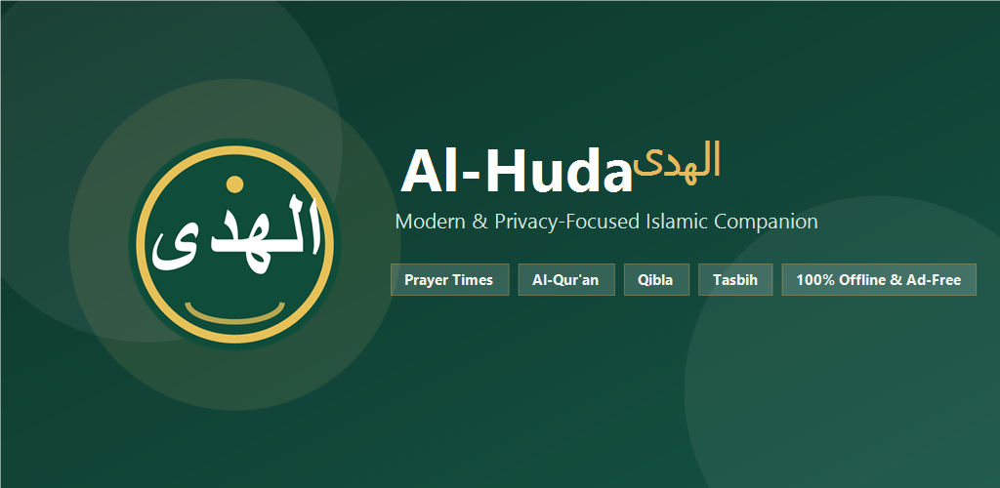

# Al-Huda

**Privacy-friendly, offline Islamic companion app for Android.**

[](LICENSE)
[](https://kotlinlang.org)
[](https://developer.android.com)
[](#privacy)

</div>

---

## About

Al-Huda is an open-source Android app for daily Islamic practices. It calculates prayer times offline, provides adhan alarms, digital Al-Qur'an with audio playback, Qibla compass, and daily dhikr tools without ads, account requirements, or background tracking.

---

## Features

- **Prayer Times**
  - Offline calculations for major methods (MWL, ISNA, Egypt, Makkah, Karachi, Tehran, Jafari).
  - Travel mode with automatic location refresh.
  - High-latitude adjustment support.
  - Custom minute adjustments for each prayer.

- **Adhan & Alarms**
  - Audio adhan with selectable muezzin voices per prayer.
  - Full-screen lockscreen alarm.
  - Pre-prayer and post-prayer reminder alarms.
  - Optional Do Not Disturb (DND) bypass.

- **Al-Qur'an**
  - Complete 114 Surahs and 30 Juz in Uthmani script.
  - Multi-language translations.
  - Ayah-by-ayah audio murottal streaming.
  - Bookmarks, jump to page, and last-read tracking.

- **Qibla Direction**
  - Real-time compass with sensor accuracy status.
  - Map-based and sensor-based modes.

- **Dhikr & Tracking**
  - Digital tasbih counter with vibration feedback.
  - Missed prayer and fast (qada) tracker.
  - Authenticated post-prayer dhikr and special prayer guides.

- **Widgets & Localization**
  - Home screen schedule and next prayer widgets.
  - Available in 13 languages (English, Indonesian, Arabic, Persian, Turkish, French, German, Urdu, Hindi, Bosnian, Vietnamese, Bengali, Swahili).

---

## Screenshots

<div align="center">

| Splash | Onboarding | Prayer Times | Navigation |
| :---: | :---: | :---: | :---: |
| 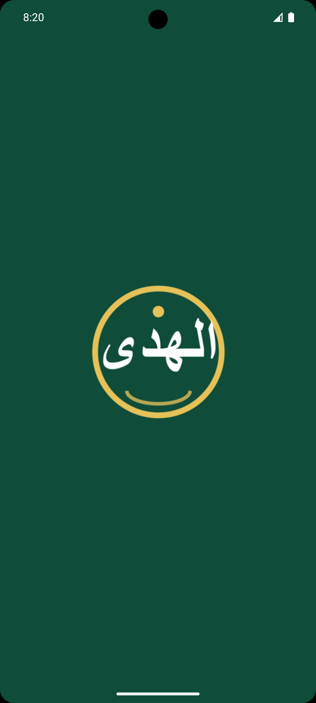 | 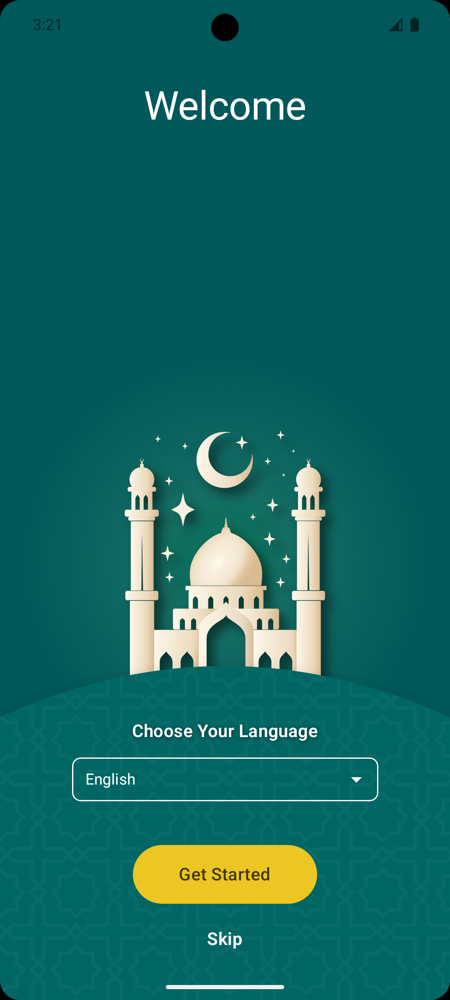 | 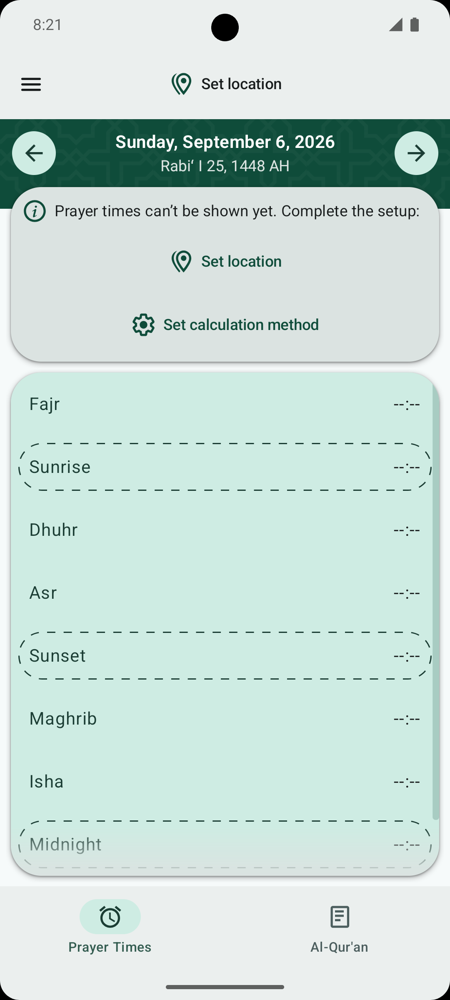 | 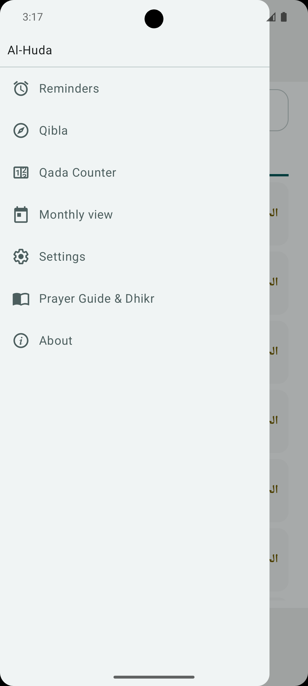 |

| Surah List | Juz List | Mushaf Reader | Qibla Compass |
| :---: | :---: | :---: | :---: |
| 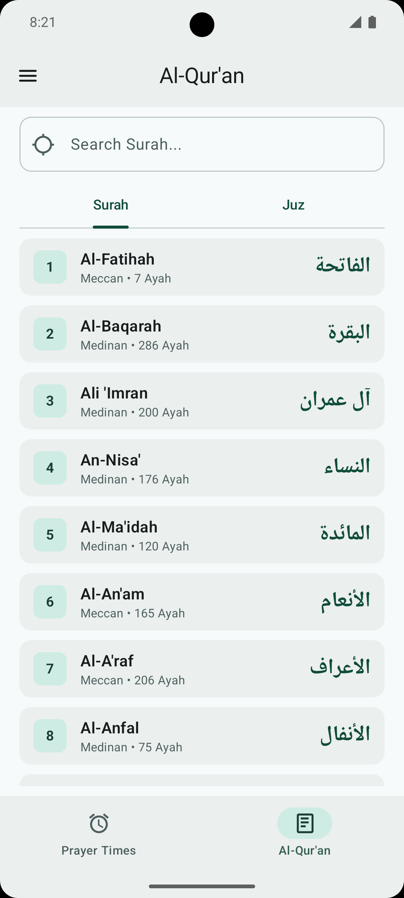 | 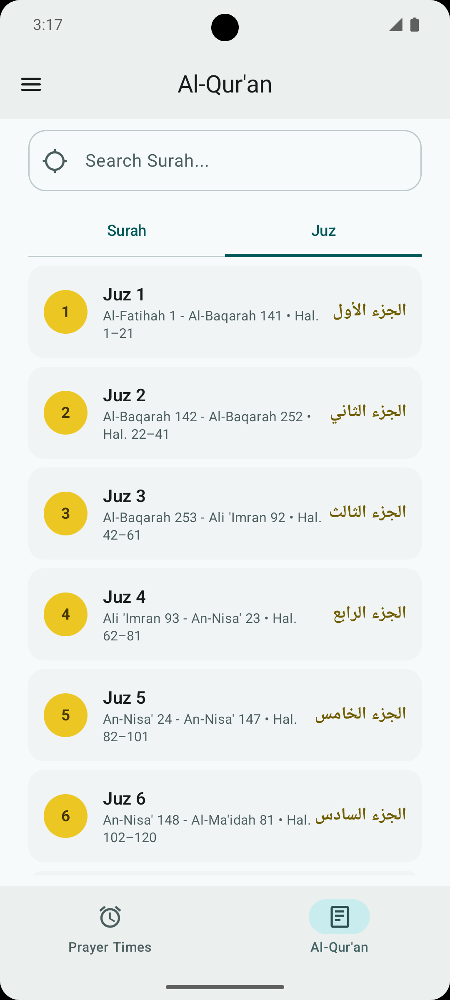 |  | 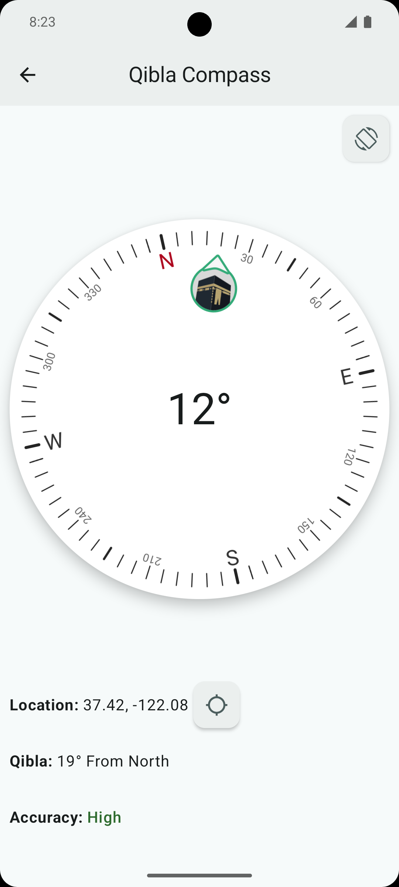 |

| Qada Counter | Monthly View | Dhikr & Du'a | Prayer Guides |
| :---: | :---: | :---: | :---: |
| 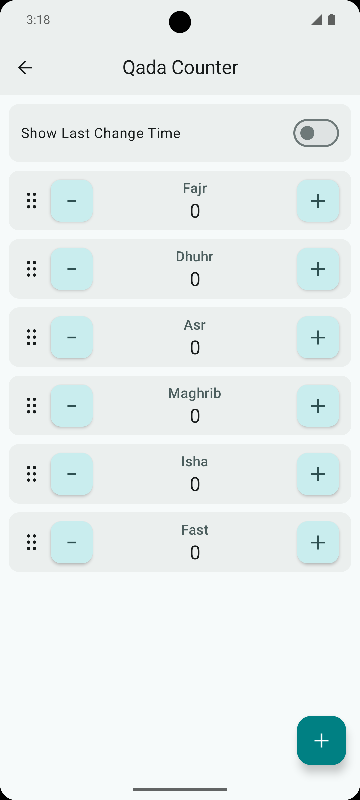 | 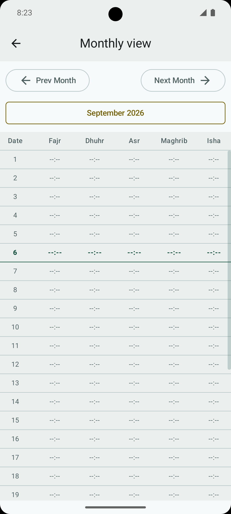 | 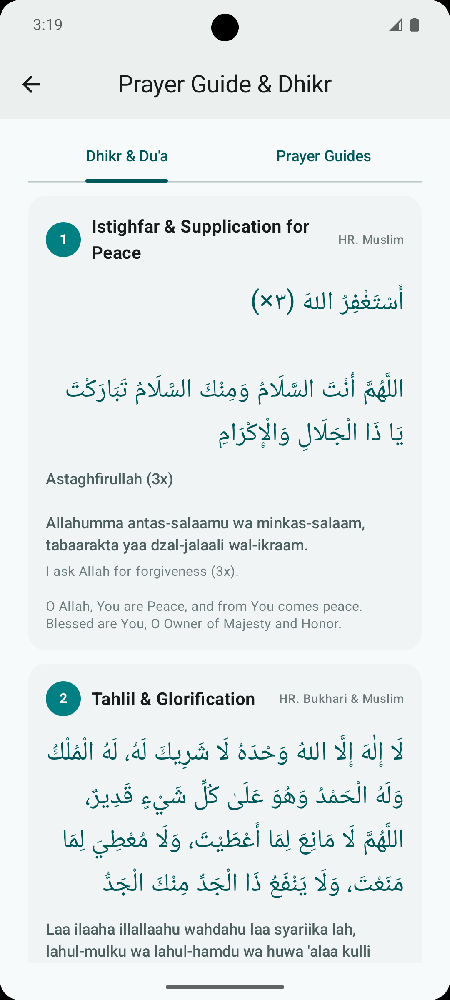 | 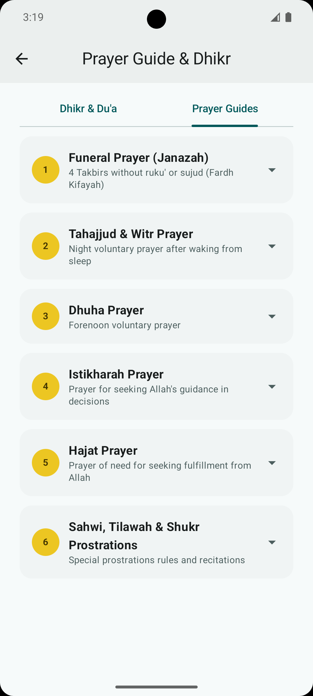 |

| Location Setup | Calculation | Schedule & Audio | Settings |
| :---: | :---: | :---: | :---: |
| 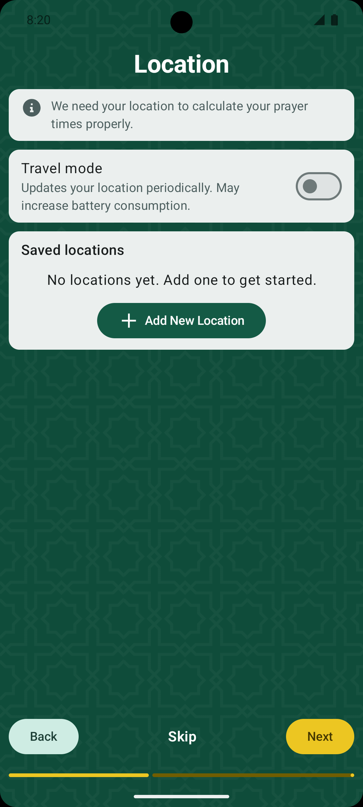 | 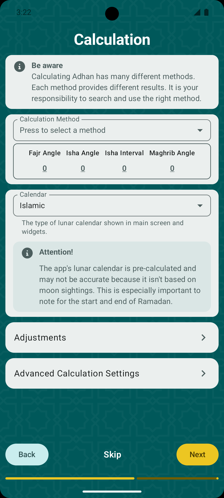 | 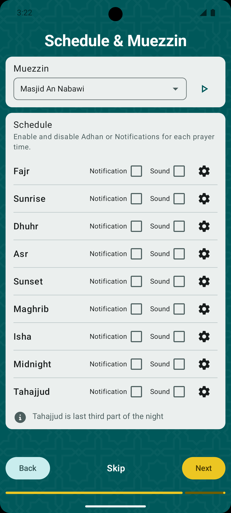 | 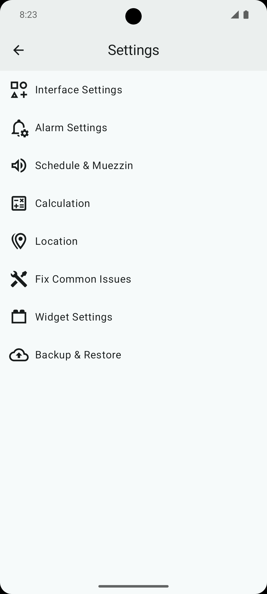 |

</div>

---

## Privacy

- **No Trackers:** No analytics, crash reporters, or advertising SDKs.
- **Local-First:** Coordinates, logs, and settings never leave the device.
- **Minimal Network:** Internet is only used when streaming audio recitations.

---

## Permissions

| Permission | Reason |
| :--- | :--- |
| `ACCESS_FINE_LOCATION` / `COARSE` | Calculate local prayer times and Qibla angle. |
| `ACCESS_BACKGROUND_LOCATION` | Optional: Update coordinates during travel mode. |
| `POST_NOTIFICATIONS` | Prayer alerts and reminders. |
| `SCHEDULE_EXACT_ALARM` | Precise alarm triggering on Android 12+. |
| `USE_FULL_SCREEN_INTENT` | Show alarm interface over lockscreen. |
| `INTERNET` | Stream murottal audio on demand. |

---

## Tech Stack

- **Language:** Kotlin
- **UI:** Jetpack Compose (Material 3)
- **Architecture:** Clean Architecture, MVI / MVVM + Coroutines Flow
- **Dependency Injection:** Hilt
- **Storage:** MMKV, DataStore
- **Media:** AndroidX Media3 / ExoPlayer

---

## Build

### Prerequisites
- Android Studio Ladybug (2024.2.1+) or newer
- JDK 17+
- Android SDK (minSdk 26, targetSdk 34)

### Commands

```bash
git clone https://github.com/saferill/Al-Huda.git
cd Al-Huda
./gradlew assembleRelease
```

---

## License

GNU Affero General Public License v3.0 (AGPL-3.0). See [LICENSE](LICENSE) for details.

Third-party libraries, fonts, and assets are documented in [THIRD_PARTY_LICENSES.md](THIRD_PARTY_LICENSES.md).
